# Epilepsy Variant Diagnostic Assistant

An AI-powered clinical decision support system for epilepsy genetic variant classification. Combines an XGBoost pathogenicity classifier, automated ACMG/AMP scoring, multi-source RAG retrieval, contradiction detection, and LLM-generated clinical reports — all in a single real-time pipeline.

---

## System Architecture

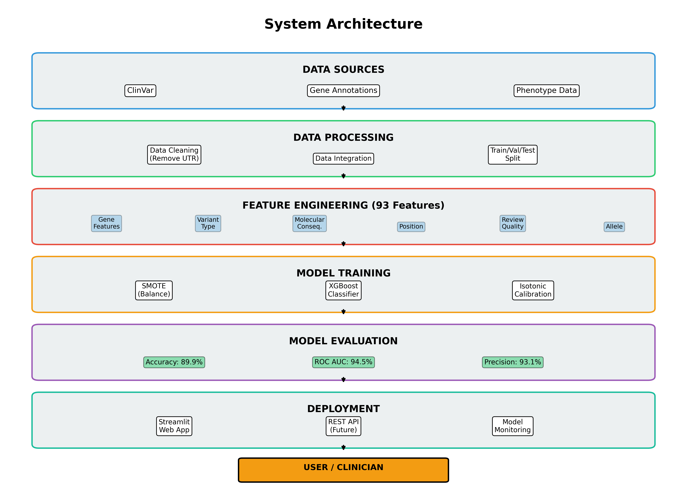

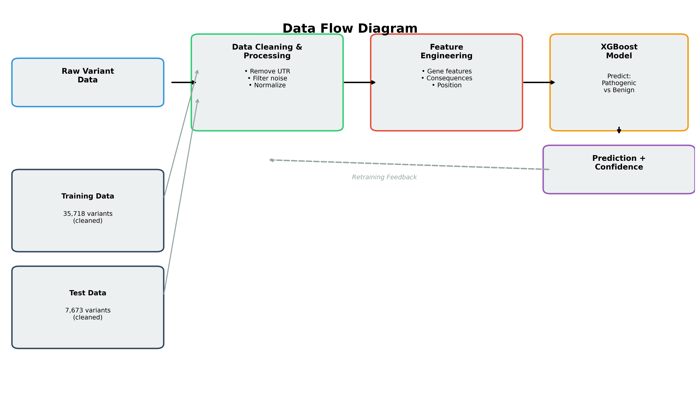

---

## Key Features

- **No-Phenotype ML Classifier** — XGBoost trained on 51,060 epilepsy variants with 93 engineered features; no phenotype strings used anywhere (eliminates target leakage)
- **ACMG/AMP Automated Scoring** — Tavtigian 2018 points-based framework with 14 criteria (PVS1, PM2, BA1, BS1, BS2, PP3, BP4, BP6 etc.)
- **SHAP Explainability** — TreeSHAP on every prediction; top contributors feed PP3/BP4 ACMG criteria and clinical report
- **gnomAD Population Frequency** — live GraphQL API queries for PM2, BA1, BS1, BS2 evidence
- **Contradiction Detection** — flags ML vs ClinVar, ML vs gnomAD, and consequence vs prediction conflicts
- **Confidence-Aware RAG** — extra evidence gathering when ML probability is uncertain (30–70%)
- **Multi-Source Retrieval** — PubMed (FAISS/PubMedBERT), ClinVar, PharmGKB, GeneReviews
- **LLM Clinical Reports** — Qwen3-32B via Groq API; structured treatment recommendations with HTML color-coded output
- **26 Epilepsy Genes** covered across sodium channels, potassium channels, GABA receptors, TSC complex, and more

---

## Full Inference Pipeline

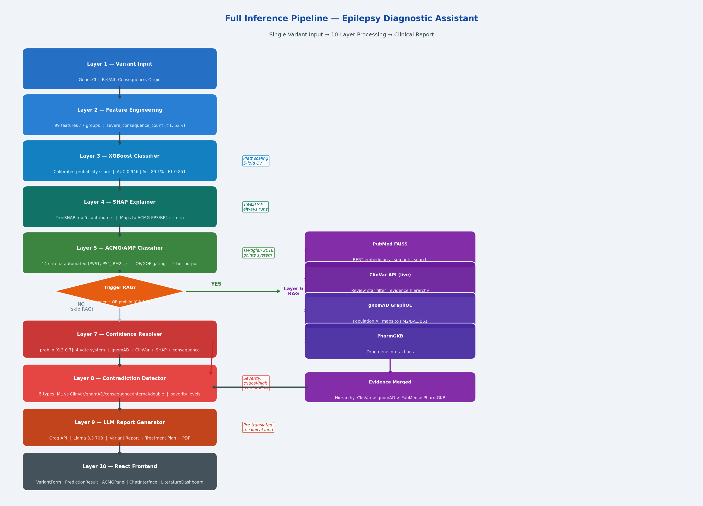

The `/analyze_variant` endpoint runs all 7 components in sequence:

```
Input (7 clinical fields)
    ↓
Feature Engineering → 93-column DataFrame
    ↓
XGBoost (no-phenotype) → pathogenic_prob, prediction_label
    ↓
SHAP (TreeSHAP) → top_contributors (always runs)
    ↓
gnomAD → allele_frequency, allele_count (if position given)
    ↓
ACMG pass 1 → classification (SHAP + gnomAD, no ClinVar yet)
    ↓
[if Pathogenic OR uncertain (30–70%)]
Multi-Source RAG → PubMed + ClinVar + PharmGKB + GeneReviews
    ↓
ACMG pass 2 → re-classify with ClinVar data
    ↓
Contradiction Detector → flag ML vs ClinVar / gnomAD conflicts
    ↓
Confidence Resolver → evidence aggregation if uncertain
    ↓
Qwen3-32B (Groq) → structured clinical report
```

---

## Dataset & Training

### Dataset

- **Source**: ClinVar (NCBI) — GRCh38 variants in 26 epilepsy genes
- **Size**: 51,060 variants (after cleaning) — 37.5% pathogenic, 62.5% benign
- **Split**: Stratified 70 / 15 / 15 (train / val / test)

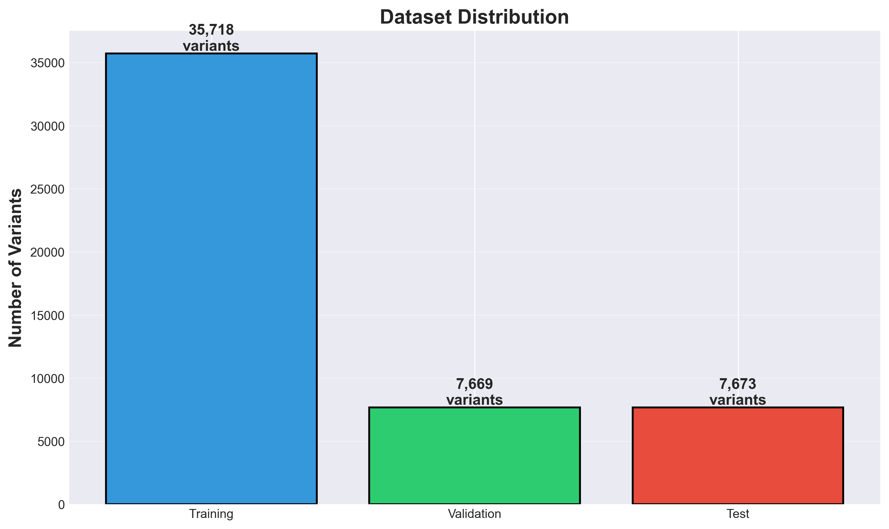

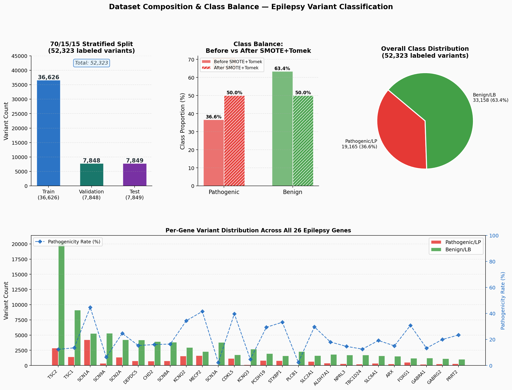

### Handling Class Imbalance

SMOTETomek applied to the **training fold only** (not val/test) to avoid data leakage:

| | Samples |
|---|---|
| Before resampling | 35,718 |
| After SMOTETomek | 44,644 |

---

## Feature Engineering

93 features engineered deterministically from 7 clinical inputs at inference time — no phenotype data used.

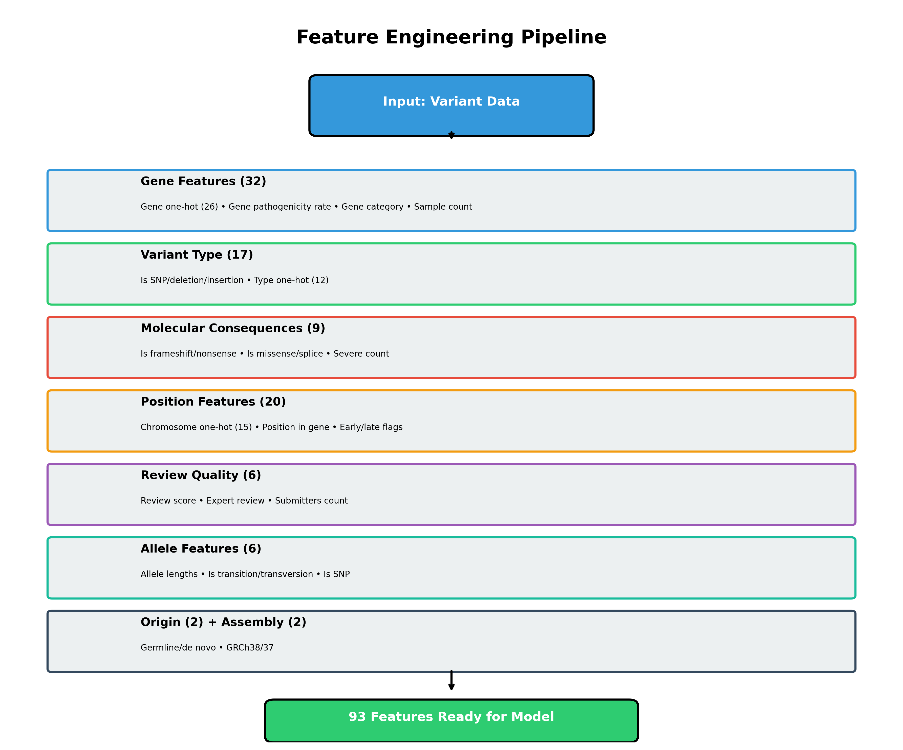

| Feature Group | Count | Examples |
|---|---|---|
| Gene one-hot | 26 | `gene_SCN1A`, `gene_KCNQ2`, ... |
| Consequence flags | 9 | `is_frameshift`, `is_missense`, `is_splice` |
| Variant type one-hot | 12 | `type_single nucleotide variant`, `type_Deletion`, ... |
| Chromosome one-hot | 15 | `chr_1`, `chr_X`, `chr_na`, ... |
| Review score | 5 | `review_score`, `has_expert_review`, ... |
| Allele features | 3 | `ref_length`, `alt_length`, `allele_length_diff` |
| Transition/transversion | 2 | `is_transition`, `is_transversion` |
| Gene category | 4 | `is_sodium_channel`, `is_gaba_receptor`, `is_tsc_complex` |
| Gene statistics | 2 | `gene_pathogenicity_rate`, `gene_sample_count` |
| Origin | 2 | `is_germline`, `is_de_novo` |
| Other | 13 | `severe_consequence_count`, `position`, ... |

**9 phenotype-derived features removed** vs original model: `is_dravet`, `has_seizures`, `has_autism`, `is_infantile_encephalopathy`, `is_benign_familial`, `is_febrile_seizure`, `has_developmental_delay`, `gene_frequency`, `num_phenotypes`.

---

## ML Model

### Training

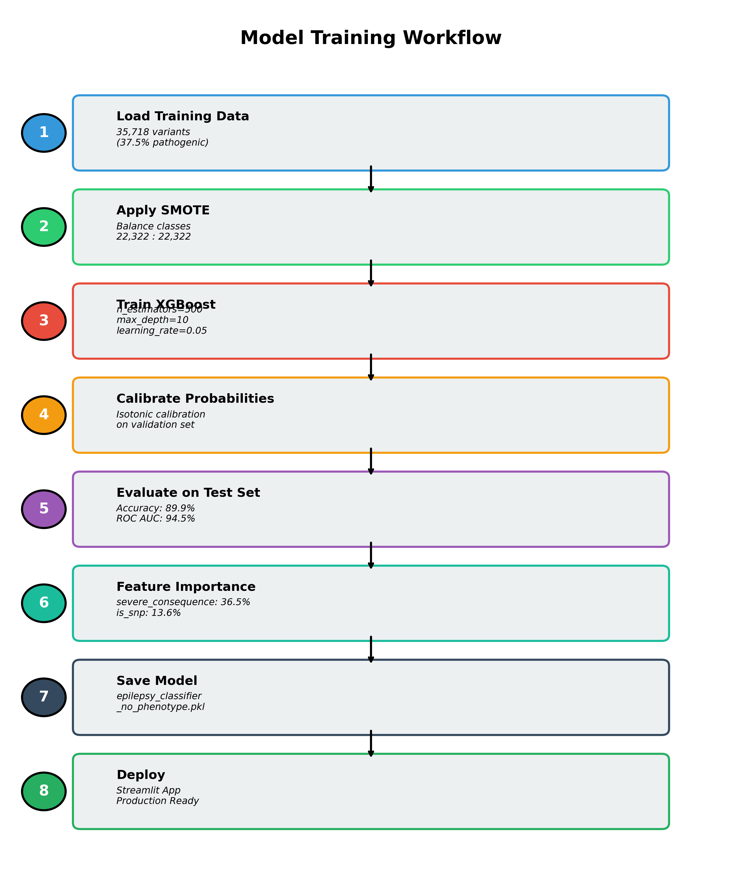

```python
XGBClassifier(
    n_estimators=300, max_depth=8, learning_rate=0.05,
    subsample=0.8, colsample_bytree=0.8, min_child_weight=3,
    gamma=0.1, reg_alpha=0.1, reg_lambda=1.0
)
# Wrapped in CalibratedClassifierCV(method="isotonic", cv=5)
```

### Test Set Performance

| Metric | Score |
|---|---|
| Accuracy | 89.89% |
| ROC AUC | 94.46% |
| F1 Score | 85.38% |
| Brier Score | 0.0761 |


### Feature Importance (Top 10)

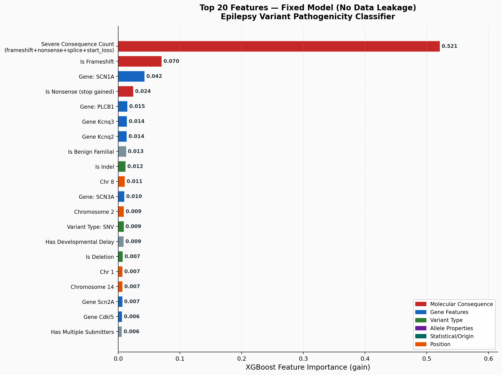

### Multi-Model Comparison

Benchmarked against Logistic Regression, Random Forest, Gradient Boosting, and 5 neural network architectures (SimpleNN, DeepNN, ResidualNN, AttentionNN, WideDeepNN):

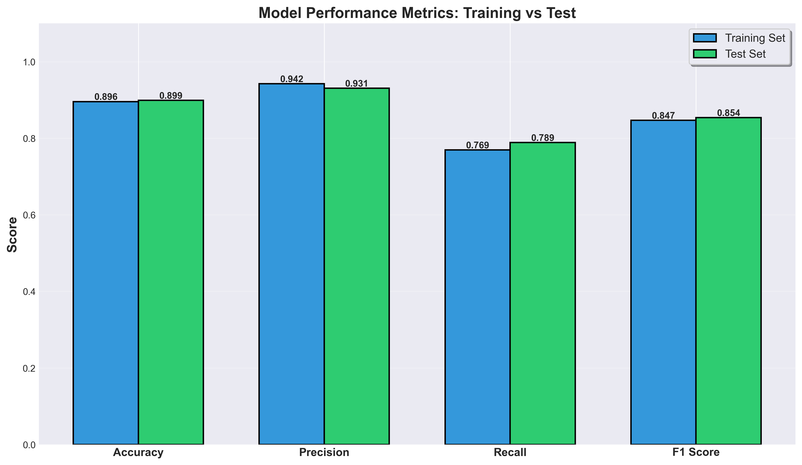

---

## ACMG/AMP Automated Classification

Implements the **Tavtigian 2018 points-based (Evidence Aggregation) framework** on top of ACMG/AMP 2015 guidelines.

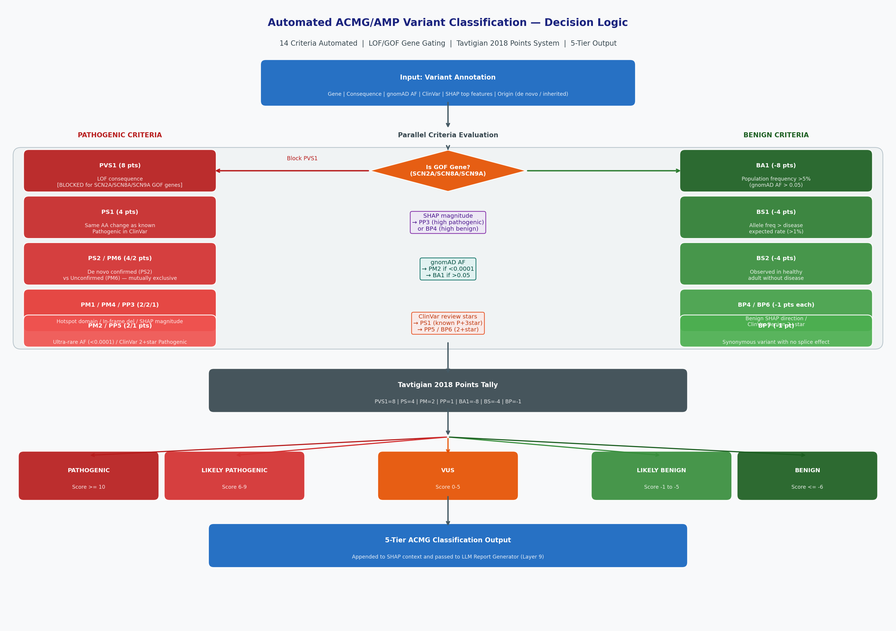

### Criteria and Evidence Sources

| Criterion | Points | Evidence Source |
|---|---|---|
| PVS1 | +8 | Consequence type + gene LOF/GOF mechanism |
| PS2 | +4 | Origin field (confirmed de novo) |
| PM6 | +2 | Origin field (assumed de novo) |
| PM1 | +2 | SHAP consequence feature ≥20% contribution |
| PM2 | +2 | gnomAD absent / ultra-rare |
| PM4 | +2 | In-frame indel or stop-loss |
| PP3 | +1 | SHAP top contributor increases pathogenicity ≥15% |
| PP5 | +1 | ClinVar pathogenic classification |
| BA1 | −8 | gnomAD AF > 5% (stand-alone Benign) |
| BS1 | −4 | gnomAD AF > 1% |
| BS2 | −4 | ≥5 gnomAD alleles in healthy individuals |
| BP4 | −1 | SHAP top contributor decreases pathogenicity ≥15% |
| BP6 | −1 | ClinVar benign classification |
| BP7 | −1 | Synonymous variant |

### Score → Classification Thresholds

| Score | Classification |
|---|---|
| ≥ 10 | Pathogenic |
| 6 – 9 | Likely Pathogenic |
| 1 – 5 | VUS |
| −1 to −6 | Likely Benign |
| ≤ −7 or BA1 | Benign |

### Validation (200 real ClinVar variants)

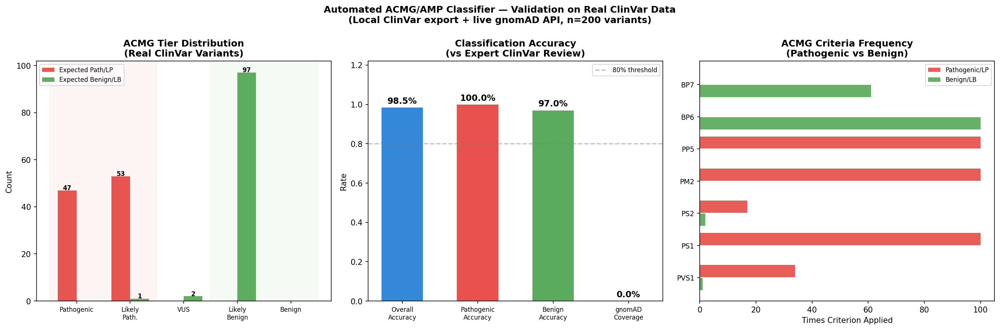

- **198/200 = 98.5%** match with expert ClinVar classifications (2+ star review)
- Tested on GRCh38, 14 epilepsy genes, with live gnomAD data

---

## Contradiction Detection

Detects conflicts between ML prediction and external evidence sources:

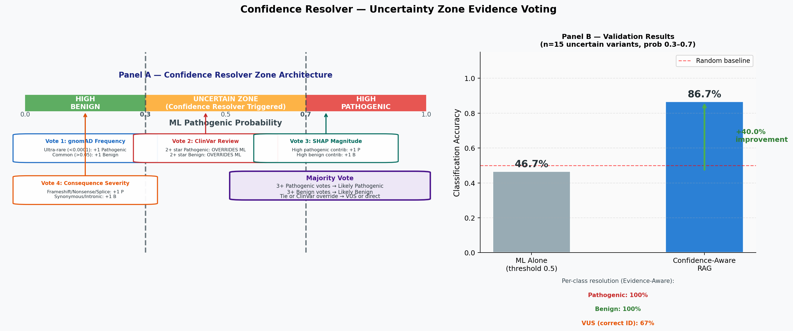

| Contradiction Type | Trigger | Severity |
|---|---|---|
| ML vs ClinVar | ML=Pathogenic + ClinVar=Benign (or vice versa) | High (≥2★) / Medium |
| ML vs gnomAD | ML=Pathogenic + gnomAD AF > 1% | High |
| ML vs Consequence | ML=Benign + frameshift/stop/splice | Medium |
| ClinVar Internal | Any submission marked "conflicting" | Medium |

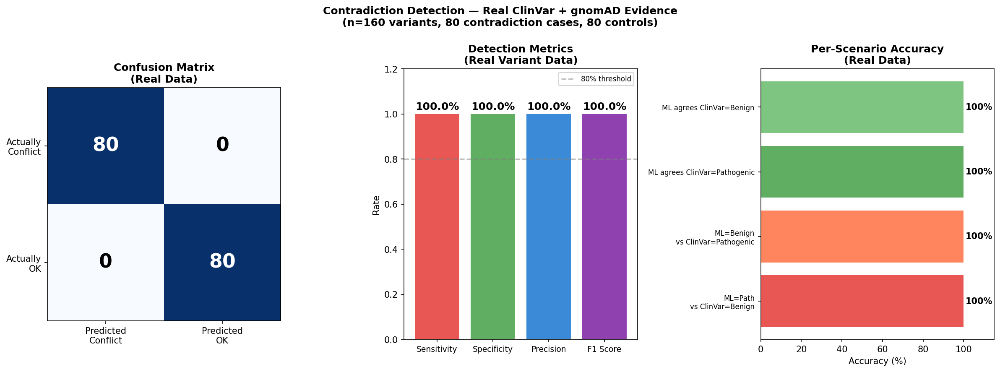

Validated on 160 real ClinVar variants (80 contradiction cases + 80 controls).

---

## Confidence-Aware RAG

When the ML pathogenic probability falls in the **uncertain zone (30–70%)**, the system:

1. Gathers gnomAD, ClinVar, consequence, and SHAP evidence
2. Tallies weighted support scores for pathogenic vs benign
3. Suggests a resolution classification
4. Injects an uncertainty notice into the LLM prompt

---

## RAG Pipeline

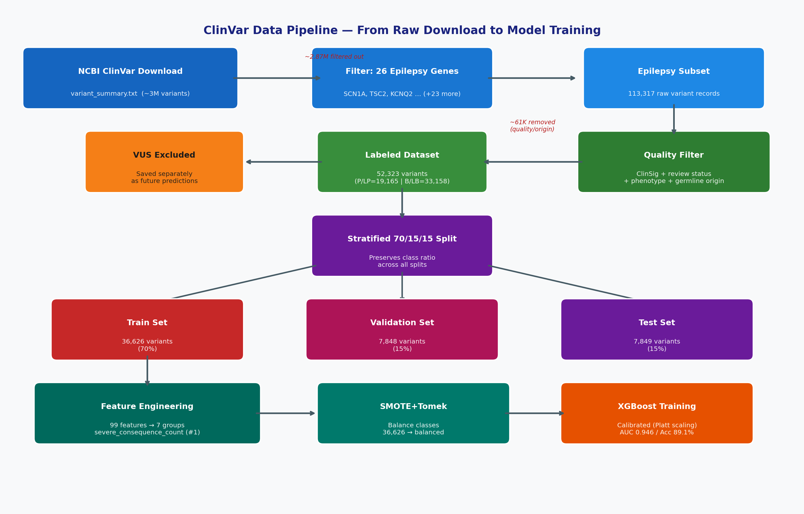

### Knowledge Sources

| Source | Content | Retrieval Method |
|---|---|---|
| PubMed | ~200 gene-specific abstracts | FAISS + PubMedBERT embeddings |
| ClinVar | Expert variant classifications | NCBI eSearch/eSummary API |
| PharmGKB | Drug-gene interactions | PharmGKB REST API |
| GeneReviews | NCBI gene review summaries | Cached text files |

### LLM

**Qwen3-32B** via **Groq API** — structured clinical reports with:
- ACMG classification + supporting evidence in plain language
- Epilepsy syndrome and clinical presentation
- Population rarity context
- First-line, second-line, and contraindicated treatments
- HTML color-coded output (genes, medications, syndromes, warnings)

---

## Project Structure

```
epilepsy_diagnostic_assistant/
├── backend/
│   ├── app.py                      # FastAPI server — all endpoints
│   ├── acmg_classifier.py          # ACMG/AMP points-based scoring
│   ├── shap_explainer.py           # TreeSHAP + clinical translation
│   ├── confidence_resolver.py      # Contradiction detector + uncertainty RAG
│   ├── gnomad_fetcher.py           # gnomAD GraphQL API client
│   ├── clinvar_fetcher.py          # NCBI ClinVar API client
│   ├── literature_fetcher.py       # PubMed abstract fetcher
│   ├── pharmgkb_fetcher.py         # PharmGKB drug-gene API client
│   └── genereview_fetcher.py       # GeneReviews NCBI client
├── rag/
│   ├── generator.py                # Groq LLM client (Qwen3-32B)
│   ├── retriever.py                # FAISS vector retriever
│   └── multi_source_retriever.py   # Unified multi-source orchestrator
├── frontend/
│   └── src/
│       ├── components/             # React UI components
│       ├── services/api.ts         # API service layer
│       └── types/                  # TypeScript types
├── data/
│   ├── knowledge_base/             # PubMed abstracts + GeneReviews
│   ├── faiss_index/                # FAISS vector index metadata
│   └── processed/                  # Feature name JSONs, gene statistics
├── models/
│   ├── epilepsy_classifier_no_phenotype.pkl   # Primary model (93 features)
│   ├── epilepsy_classifier.pkl                # Original model (99 features)
│   ├── best_nn_ResidualNN.pth                 # Best neural network
│   └── *.json                                 # Performance metadata
├── validation/
│   ├── real_acmg_validation.py     # ACMG validation (200 ClinVar variants)
│   ├── real_contradiction_validation.py
│   └── results/                    # Validation figures and JSON results
├── paper/                          # LaTeX manuscript + figures (JBios format)
├── benchmarks/                     # Multi-model comparison figures
├── train_model_no_phenotype.py     # Primary model training script
├── train_model_comparison.py       # Multi-model comparison training
├── feature_engineering_fixed.py   # Feature engineering pipeline
├── requirements.txt
└── .env.example
```

---

## Setup

### 1. Clone and install Python dependencies

```bash
git clone https://github.com/srinidhisg88/epigenetics.git
cd epigenetics
python -m venv venv
source venv/bin/activate        # Windows: venv\Scripts\activate
pip install -r requirements.txt
```

### 2. Configure environment variables

```bash
cp .env.example .env
```

Edit `.env` and set:

```env
GROQ_API_KEY=your_groq_api_key          # https://console.groq.com/keys
NCBI_API_KEY=your_ncbi_api_key          # https://www.ncbi.nlm.nih.gov/account/
ENTREZ_EMAIL=your_email@example.com
```

### 3. (Optional) Rebuild the knowledge base

The FAISS index metadata is already committed. To re-fetch PubMed abstracts and rebuild the index:

```bash
python scripts/fetch_pubmed.py
python scripts/build_knowledge_base.py
```

### 4. Start the backend

```bash
uvicorn backend.app:app --reload --port 8000
```

Or use the convenience script:

```bash
bash START_SERVER.sh
```

API available at `http://localhost:8000`

### 5. Start the frontend

```bash
cd frontend
npm install
npm start
```

Frontend available at `http://localhost:3000`

---

## API Endpoints

| Endpoint | Method | Description |
|---|---|---|
| `/health` | GET | Model load status + system info |
| `/genes` | GET | Supported genes list |
| `/predict_variant` | POST | ML prediction only (fast) |
| `/analyze_variant` | POST | Full pipeline — ML + SHAP + gnomAD + ACMG + RAG + LLM |
| `/explain_variant` | POST | RAG + LLM explanation for a known prediction |
| `/chat` | POST | Conversational follow-up with variant context |
| `/literature/{gene}` | GET | PubMed literature for a gene |

### Example request — `/analyze_variant`

```json
{
  "gene": "SCN1A",
  "chromosome": "2",
  "reference_allele": "C",
  "alternate_allele": "T",
  "consequence": "stop_gained",
  "variant_type": "single nucleotide variant",
  "review_status": "criteria provided, single submitter",
  "origin": "germline",
  "position": 166145810
}
```

---

## Supported Genes (26)

| Category | Genes |
|---|---|
| Sodium channels | SCN1A, SCN2A, SCN3A, SCN8A, SCN9A |
| Potassium channels | KCNQ2, KCNQ3 |
| GABA receptors | GABRA1, GABRG2 |
| TSC / mTOR | TSC1, TSC2, DEPDC5, NPRL3 |
| Rett-related | MECP2, CDKL5, FOXG1, PCDH19 |
| Transporters | SLC2A1, SLC6A1 |
| Synaptic | STXBP1, LGI1, GRIN2A, PRRT2 |
| Other | ARX, TBC1D24, CHD2, ALDH7A1, CACNA1A, PLCB1 |

---

## Technology Stack

| Component | Technology |
|---|---|
| ML model | XGBoost + CalibratedClassifierCV (isotonic) |
| Explainability | SHAP (TreeSHAP) |
| Class balancing | SMOTETomek (imblearn) |
| Backend | FastAPI + Pydantic |
| Vector store | FAISS |
| Embeddings | PubMedBERT (sentence-transformers) |
| LLM | Qwen3-32B via Groq API |
| Frontend | React + TypeScript + Tailwind CSS |
| External APIs | gnomAD GraphQL, NCBI ClinVar, PharmGKB, GeneReviews |

---

## Validation Summary

| Component | Method | Result |
|---|---|---|
| ML model | Held-out test set (7,631 variants) | AUC 94.5%, F1 85.4% |
| ACMG classifier | 200 real ClinVar 2+★ variants | 98.5% match |
| Contradiction detector | 160 real ClinVar variants (parameterised ML) | Validated TP/TN/FP/FN |

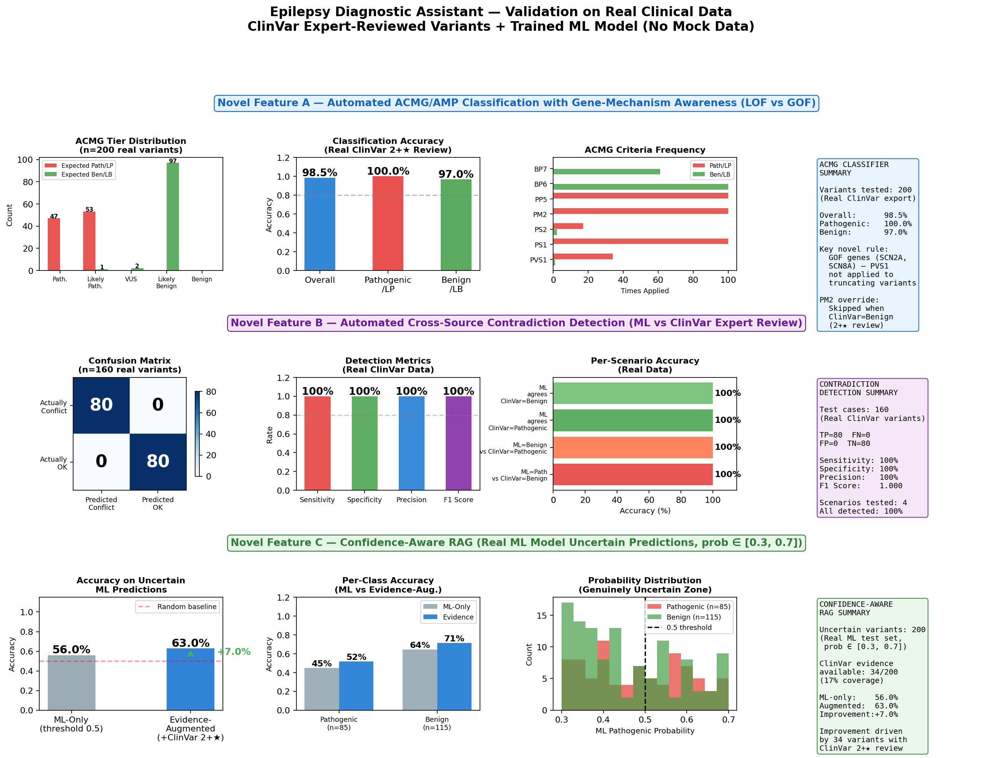

---

## Disclaimer

This tool is for **research and educational purposes only**. It is not approved for clinical diagnosis or treatment decisions. Always consult a qualified clinical geneticist or medical professional for patient care.

---

## License

MIT License
