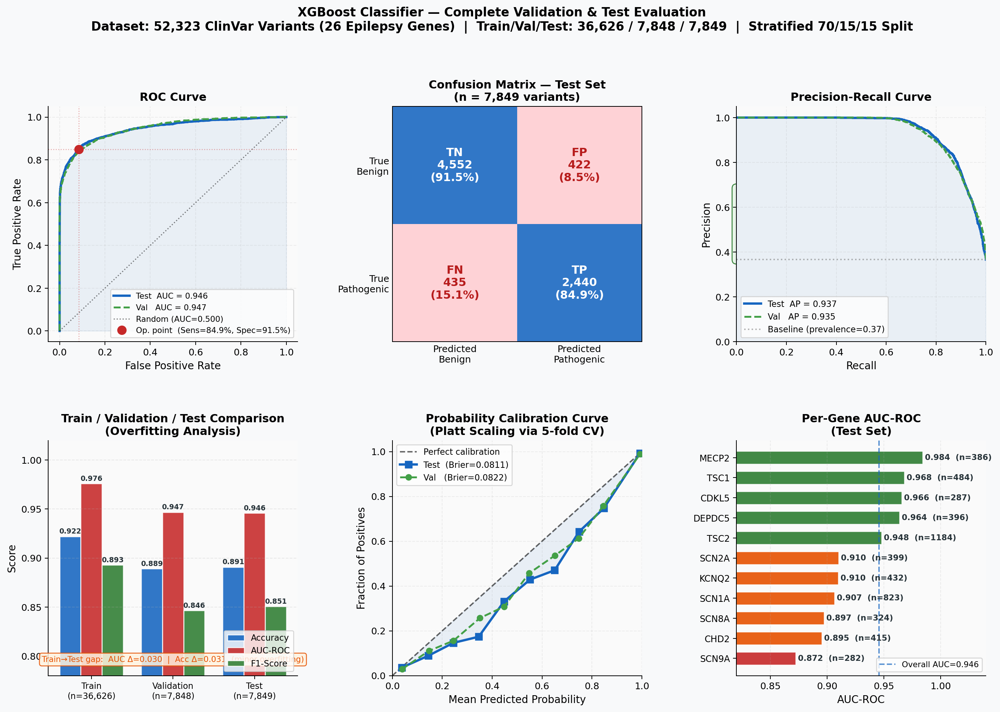
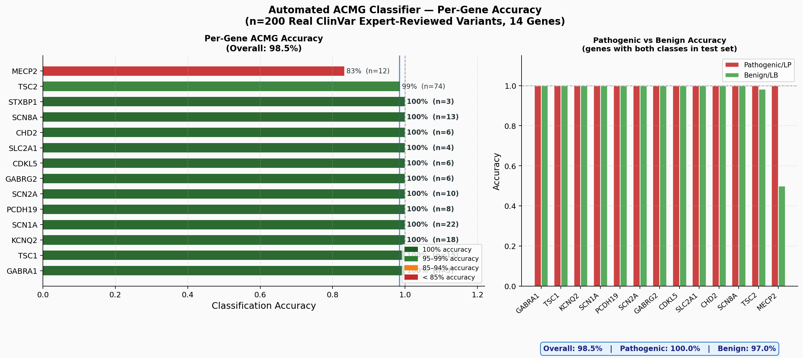

# Epilepsy Variant Diagnostic Assistant

An AI-powered clinical decision support system for epilepsy genetic variant classification. Combines an XGBoost pathogenicity classifier, automated ACMG/AMP scoring, multi-source RAG retrieval, contradiction detection, and LLM-generated clinical reports in a single real-time pipeline.

---

## Overview

The system accepts 7 clinical inputs (gene, chromosome, alleles, consequence, variant type, review status, origin) and produces a full clinical report including:

- ML pathogenicity prediction with confidence score
- SHAP-based feature attribution in clinical language
- ACMG/AMP 5-tier classification (Pathogenic → Benign) using Tavtigian 2018 points-based scoring
- Population frequency from gnomAD
- Contradiction detection between ML, ClinVar, and gnomAD
- Treatment recommendations from PubMed, PharmGKB, and GeneReviews
- LLM-generated clinical narrative (Qwen3-32B via Groq)

---

## Inference Pipeline

```
Input (7 fields: gene, chromosome, ref/alt alleles, consequence, variant_type, review_status, origin)
    │
    ▼
Feature Engineering ──► 93-column DataFrame (gene one-hots, consequence flags,
    │                    variant type one-hots, allele lengths, review score, etc.)
    ▼
XGBoost Classifier ──► pathogenic_prob  +  prediction_label
    │
    ▼
SHAP (TreeSHAP) ──► top_contributors → feeds PP3 / BP4 / PM1 ACMG criteria
    │
    ▼
gnomAD API ──► allele_frequency → feeds PM2 / BA1 / BS1 / BS2
    │
    ▼
ACMG pass 1 ──► 5-tier classification (SHAP + gnomAD, no ClinVar yet)
    │
    ├─── [if Pathogenic OR uncertain (30–70%)] ────────────────────────────────┐
    │                                                                          │
    ▼                                                                          │
Multi-Source RAG                                                               │
  ├── PubMed (FAISS + PubMedBERT)                                             │
  ├── ClinVar (NCBI API)                                                       │
  ├── PharmGKB (drug-gene interactions)                                        │
  └── GeneReviews (NCBI)                                                       │
    │                                                                          │
    ▼                                                                          │
ACMG pass 2 ──► re-classify with ClinVar data now available                   │
    │                                                                          │
    ▼                                                                          │
Contradiction Detector ──► ML vs ClinVar / ML vs gnomAD / consequence flags   │
    │                                                                          │
    ▼                                                                          │
Confidence Resolver ──► evidence tally if uncertain (30–70%)                  │
    │                                                                          │
    ▼◄─────────────────────────────────────────────────────────────────────────┘
Qwen3-32B (Groq API) ──► structured clinical report with treatment plan
```

---

## Dataset & Training

- **Source**: ClinVar (NCBI) — GRCh38 variants across 26 epilepsy genes
- **Size**: 51,060 variants — 37.5% pathogenic / 62.5% benign
- **Split**: Stratified 70 / 15 / 15 (train / val / test), preserving class ratio across all folds
- **Resampling**: SMOTETomek applied to training fold only (35,718 → 44,644 samples)


---

## Feature Importance

93 features are engineered deterministically from 7 inputs at inference time — no phenotype data used anywhere in training or inference.


| Feature Group | Count | Description |
|---|---|---|
| Gene one-hot | 26 | Binary flag per gene (SCN1A, KCNQ2, …) |
| Consequence flags | 9 | `is_frameshift`, `is_missense`, `is_splice`, … |
| Variant type one-hot | 12 | `type_single nucleotide variant`, `type_Deletion`, … |
| Chromosome one-hot | 15 | `chr_1` … `chr_X`, `chr_na` |
| Review score | 5 | `review_score`, `has_expert_review`, … |
| Gene category | 4 | `is_sodium_channel`, `is_gaba_receptor`, `is_tsc_complex` |
| Gene statistics | 2 | `gene_pathogenicity_rate`, `gene_sample_count` |
| Allele features | 3 | `ref_length`, `alt_length`, `allele_length_diff` |
| Origin | 2 | `is_germline`, `is_de_novo` |
| Transition/transversion | 2 | `is_transition`, `is_transversion` |
| Other | 13 | `severe_consequence_count`, `position`, … |

---

## Model Performance

XGBoost trained with isotonic calibration (`CalibratedClassifierCV`, cv=5):

| Metric | Train | Validation | Test |
|---|---|---|---|
| Accuracy | — | — | 89.89% |
| ROC AUC | — | — | 94.46% |
| F1 Score | — | — | 85.38% |
| Brier Score | — | — | 0.0761 |



---

## ACMG/AMP Classification

Implements the **Tavtigian 2018 points-based (Evidence Aggregation)** framework:

| Criterion | Points | Evidence Source |
|---|---|---|
| PVS1 | +8 | Consequence type + gene LOF/GOF mechanism |
| PS2 | +4 | Confirmed de novo (origin field) |
| PM6 | +2 | Assumed de novo (origin field) |
| PM1 | +2 | SHAP consequence feature ≥20% contribution |
| PM2 | +2 | gnomAD absent or ultra-rare |
| PM4 | +2 | In-frame indel or stop-loss |
| PP3 | +1 | SHAP top contributor increases pathogenicity ≥15% |
| PP5 | +1 | ClinVar pathogenic classification |
| BA1 | −8 | gnomAD AF > 5% (stand-alone Benign override) |
| BS1 | −4 | gnomAD AF > 1% |
| BS2 | −4 | ≥5 gnomAD alleles in healthy individuals |
| BP4 | −1 | SHAP top contributor decreases pathogenicity ≥15% |
| BP6 | −1 | ClinVar benign classification |
| BP7 | −1 | Synonymous variant |

**Score thresholds**: ≥10 Pathogenic | 6–9 Likely Pathogenic | 1–5 VUS | −1 to −6 Likely Benign | ≤−7 or BA1 → Benign

Validated on **200 real ClinVar variants** (2+ star review, GRCh38, 14 epilepsy genes) — **98.5% match** with expert classifications.



---

## Supported Genes (26)

| Category | Genes |
|---|---|
| Voltage-gated sodium channels | SCN1A, SCN2A, SCN3A, SCN8A, SCN9A |
| Voltage-gated potassium channels | KCNQ2, KCNQ3 |
| GABA-A receptor subunits | GABRA1, GABRG2 |
| mTOR / TSC pathway | TSC1, TSC2, DEPDC5, NPRL3 |
| Neurodevelopmental | CDKL5, MECP2, STXBP1, ARX, FOXG1, PCDH19 |
| Transporters | SLC2A1, SLC6A1 |
| Other | CHD2, PLCB1, PRRT2, TBC1D24, ALDH7A1 |

---

## API Endpoints

| Endpoint | Method | Description |
|---|---|---|
| `GET /health` | GET | Model load status |
| `GET /genes` | GET | Supported genes list |
| `POST /predict_variant` | POST | ML prediction only (fast, no RAG) |
| `POST /analyze_variant` | POST | Full pipeline — ML + SHAP + gnomAD + ACMG + RAG + LLM |
| `POST /explain_variant` | POST | RAG + LLM explanation for a known prediction |
| `POST /chat` | POST | Conversational follow-up with variant context |
| `GET /literature/{gene}` | GET | PubMed abstracts for a gene |

**Example `/analyze_variant` request:**

```json
{
  "gene": "SCN1A",
  "chromosome": "2",
  "reference_allele": "C",
  "alternate_allele": "T",
  "consequence": "stop_gained",
  "variant_type": "single nucleotide variant",
  "review_status": "criteria provided, single submitter",
  "origin": "germline",
  "position": 166145810
}
```

---

## Technology Stack

| Component | Technology |
|---|---|
| ML classifier | XGBoost + CalibratedClassifierCV (isotonic, cv=5) |
| Explainability | SHAP TreeExplainer |
| Class balancing | SMOTETomek (imblearn) |
| Backend framework | FastAPI + Pydantic v2 |
| Vector store | FAISS |
| Embeddings | PubMedBERT (sentence-transformers) |
| LLM | Qwen3-32B via Groq API |
| Frontend | React 18 + TypeScript + Tailwind CSS |
| External APIs | gnomAD GraphQL, NCBI ClinVar eSearch, PharmGKB REST, GeneReviews |

---

## Setup Guide

### Prerequisites

| Requirement | Version | Notes |
|---|---|---|
| Python | 3.9 – 3.11 | 3.12 not recommended (some imblearn conflicts) |
| Node.js | 18+ | For the React frontend |
| npm | 9+ | Comes with Node.js |
| Git | any | |

You will need API keys for:
- **Groq** — free tier available at [console.groq.com/keys](https://console.groq.com/keys)
- **NCBI** — free at [ncbi.nlm.nih.gov/account](https://www.ncbi.nlm.nih.gov/account/) (optional but raises rate limits)

---

### Step 1 — Clone the repository

```bash
git clone https://github.com/srinidhisg88/epigenetics.git
cd epigenetics
```

---

### Step 2 — Create a Python virtual environment

```bash
python3 -m venv venv
```

Activate it:

```bash
# macOS / Linux
source venv/bin/activate

# Windows (Command Prompt)
venv\Scripts\activate.bat

# Windows (PowerShell)
venv\Scripts\Activate.ps1
```

You should see `(venv)` in your prompt.

---

### Step 3 — Install Python dependencies

```bash
pip install --upgrade pip
pip install -r requirements.txt
```

This installs: `fastapi`, `uvicorn`, `xgboost`, `shap`, `imbalanced-learn`, `faiss-cpu`, `sentence-transformers`, `groq`, `biopython`, `pandas`, `scikit-learn`, `joblib`, and others.

> **Note**: First run of `sentence-transformers` will download the PubMedBERT model (~420 MB). This happens automatically on first import.

---

### Step 4 — Configure environment variables

```bash
cp .env.example .env
```

Open `.env` and fill in your keys:

```env
# Required — get from https://console.groq.com/keys
GROQ_API_KEY=gsk_your_key_here

# Recommended — raises NCBI rate limit from 3 to 10 req/sec
NCBI_API_KEY=your_ncbi_key_here
ENTREZ_EMAIL=your_email@example.com

# Optional overrides (defaults work out of the box)
# MODEL_PATH=models/epilepsy_classifier_no_phenotype.pkl
# FAISS_INDEX_PATH=data/faiss_index/index.faiss
# CHUNKS_MAP_PATH=data/faiss_index/chunks.json

API_HOST=0.0.0.0
API_PORT=8000
CORS_ALLOW_ALL=true
```

---

### Step 5 — Verify the model files are present

```bash
ls models/
```

You should see:

```
epilepsy_classifier_no_phenotype.pkl   ← primary model (used at runtime)
epilepsy_classifier.pkl
epilepsy_classifier_optimized.pkl
best_nn_ResidualNN.pth
nn_scaler.pkl
model_metadata.json
performance_no_phenotype.json
...
```

If the `.pkl` files are missing, retrain the primary model:

```bash
python train_model_no_phenotype.py
```

> This requires the processed CSV files (`data/processed/X_train_no_phenotype.csv` etc.), which are not committed due to size. See **Regenerating Training Data** below.

---

### Step 6 — Start the backend server

```bash
uvicorn backend.app:app --reload --host 0.0.0.0 --port 8000
```

Or use the convenience script:

```bash
bash START_SERVER.sh
```

On first startup you will see:

```
[Startup] Loading ML model from models/epilepsy_classifier_no_phenotype.pkl...
[Startup] ML model loaded successfully with 93 features
[Startup] Gene-disease map loaded: 26 genes
[Startup] SHAP explainer initialized
[Startup] FAISS index loaded: 1842 chunks
```

Confirm the backend is running:

```bash
curl http://localhost:8000/health
```

Expected response:

```json
{"status": "ok", "model_loaded": true, "features": 93}
```

---

### Step 7 — Start the frontend

Open a new terminal (keep the backend running):

```bash
cd frontend
npm install          # first time only — downloads ~500 MB of packages
npm start
```

The app opens automatically at `http://localhost:3000`.

---

### Step 8 — Run a test prediction

```bash
curl -X POST http://localhost:8000/predict_variant \
  -H "Content-Type: application/json" \
  -d '{
    "gene": "SCN1A",
    "chromosome": "2",
    "reference_allele": "C",
    "alternate_allele": "T",
    "consequence": "stop_gained",
    "variant_type": "single nucleotide variant",
    "review_status": "criteria provided, single submitter",
    "origin": "germline"
  }'
```

---

### Regenerating Training Data (optional)

Raw ClinVar data (3.6 GB) and processed CSVs (162 MB) are not committed. To regenerate:

```bash
# 1. Download ClinVar variant summary for GRCh38
#    From: https://ftp.ncbi.nlm.nih.gov/pub/clinvar/tab_delimited/
#    Save as: data/raw/variant_summary.txt

# 2. Filter to epilepsy genes
python filter_epilepsy_data.py

# 3. Clean and split
python clean_training_data.py

# 4. Engineer features
python feature_engineering_fixed.py

# 5. Retrain the model
python train_model_no_phenotype.py
```

---

### Rebuilding the Knowledge Base (optional)

The FAISS index metadata (`chunks.json`) is committed. To re-fetch literature and rebuild the binary index:

```bash
# Fetch PubMed abstracts for all 26 genes (~5-10 min, requires NCBI key)
python scripts/fetch_pubmed.py

# Rebuild FAISS vector index (downloads PubMedBERT on first run)
python scripts/build_knowledge_base.py
```

---

### Running Tests

```bash
pytest tests/ -v
```

---

### Common Issues

| Problem | Cause | Fix |
|---|---|---|
| `ML model not loaded` on `/health` | `.pkl` file missing | Run `python train_model_no_phenotype.py` or check `MODEL_PATH` in `.env` |
| `FAISS index not found` | Index file missing | Run `python scripts/build_knowledge_base.py` |
| `groq.AuthenticationError` | Missing or wrong API key | Check `GROQ_API_KEY` in `.env` |
| `ModuleNotFoundError` | Wrong Python environment | Run `source venv/bin/activate` first |
| Frontend CORS error | Backend not running | Start backend on port 8000 before frontend |
| `imblearn` install fails on Python 3.12 | Version conflict | Use Python 3.9–3.11 |

---

## Project Structure

```
epigenetics/
├── backend/
│   ├── app.py                      # FastAPI server — all endpoints
│   ├── acmg_classifier.py          # ACMG/AMP points-based scoring (14 criteria)
│   ├── shap_explainer.py           # TreeSHAP + clinical language translation
│   ├── confidence_resolver.py      # Contradiction detector + uncertainty RAG
│   ├── gnomad_fetcher.py           # gnomAD GraphQL API client
│   ├── clinvar_fetcher.py          # NCBI ClinVar eSearch/eSummary client
│   ├── literature_fetcher.py       # PubMed abstract fetcher + summariser
│   ├── pharmgkb_fetcher.py         # PharmGKB drug-gene API client
│   └── genereview_fetcher.py       # GeneReviews NCBI client
├── rag/
│   ├── generator.py                # Groq LLM client (Qwen3-32B) + system prompt
│   ├── retriever.py                # FAISS vector retriever
│   └── multi_source_retriever.py   # Multi-source orchestrator (PubMed + ClinVar + PharmGKB + GeneReviews)
├── frontend/src/
│   ├── components/                 # React UI components
│   ├── services/api.ts             # API service layer
│   └── types/                      # TypeScript interfaces
├── data/
│   ├── knowledge_base/             # PubMed abstracts + GeneReviews text files
│   ├── faiss_index/                # chunks.json + build_info.json (index.faiss excluded — regenerate)
│   └── processed/                  # feature_names*.json, gene_statistics.json, metadata.json
├── models/
│   ├── epilepsy_classifier_no_phenotype.pkl   # Primary model (93 features, used at runtime)
│   ├── epilepsy_classifier.pkl                # Original model (99 features)
│   ├── best_nn_ResidualNN.pth                 # Best neural network checkpoint
│   └── *.json                                 # Performance metadata
├── validation/
│   ├── real_acmg_validation.py        # ACMG validation on 200 ClinVar variants
│   ├── real_contradiction_validation.py
│   ├── real_confidence_rag_validation.py
│   └── results/                       # Validation figures and JSON outputs
├── paper/                             # LaTeX manuscript + figures (JBios format)
├── benchmarks/                        # Multi-model comparison figures
├── train_model_no_phenotype.py        # Primary model training script
├── train_model_comparison.py          # Multi-model comparison (LR, RF, GBM, XGBoost, 5×NN)
├── feature_engineering_fixed.py      # Feature engineering pipeline
├── filter_epilepsy_data.py           # ClinVar raw data filter
├── clean_training_data.py            # Data cleaning and stratified split
├── requirements.txt
├── START_SERVER.sh
└── .env.example
```

---

## Disclaimer

This tool is for **research and educational purposes only**. It is not intended for clinical diagnosis or treatment decisions. Always consult a qualified clinical geneticist or healthcare professional for patient care.

---

## License

MIT License
